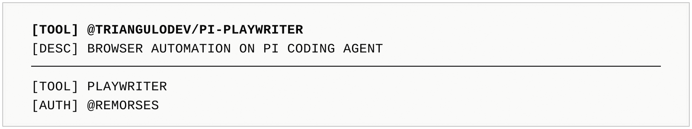

# pi-playwriter



Native [Pi](https://pi.dev/) package that registers a `playwriter` tool for the [Playwriter CLI](https://github.com/remorses/playwriter).

It helps Pi agents inspect Playwriter setup, install or update the CLI, and run Playwriter commands from a native tool interface.

## Installation

```bash
pi install npm:pi-playwriter
# or from a local checkout:
pi install ./pi-playwriter
```

For a one-off run without adding the package to settings:

```bash
pi -e ./pi-playwriter
```

## Tool

The package registers one native Pi tool:

- `playwriter`

Supported actions:

| Action | Purpose |
| --- | --- |
| `doctor` | Inspect Node/npm/Playwriter installation, version, npm latest, sessions, and usage instructions. |
| `update` | Install/update the Playwriter CLI. Defaults to `npm install --global playwriter@latest`; set `dryRun: true` to verify the command without mutating the installation. |
| `eval` | Run JavaScript through `playwriter --eval`. Can auto-create a session when none is supplied. |
| `session_new` | Run `playwriter session new`. |
| `session_list` | Run `playwriter session list`. |
| `session_delete` | Run `playwriter session delete <session>`. |
| `session_reset` | Run `playwriter session reset <session>`. |
| `skill` | Print Playwriter usage instructions. |
| `logfile` | Print the Playwriter relay logfile path. |
| `version` | Print `playwriter --version`. |

### Example prompts

```text
Run playwriter doctor and fix any installation issue you find.
```

```text
Use playwriter to create a browser session and inspect the title of the current page.
```

The model should call:

```json
{
  "action": "eval",
  "code": "console.log(await page.title())"
}
```

## Development

Commands:

```bash
npm install
npm run typecheck
npm test
npm run verify
npm run pack:dry
```

## Publishing

1. Confirm `npm run verify` and `npm run pack:dry` pass.
2. Trigger `.github/workflows/release.yml` manually.

The release workflow uses npm trusted publishing/provenance (`npm publish --provenance`).

## Pi package references

- [pi-codex-goal](https://github.com/fitchmultz/pi-codex-goal): reference for a typed Pi extension package with `src/`, `pi.extensions`, `verify = typecheck + test`, and npm-ready `files` metadata.
- [pi-subagents](https://github.com/nicobailon/pi-subagents): reference for GitHub Actions split between test and release workflows, including npm provenance publishing.
- [pi-web-access](https://github.com/nicobailon/pi-web-access): reference for a single-extension Pi package with `pi-package` keywords and runtime package metadata.
- [rpiv-todo](https://github.com/juicesharp/rpiv-mono/tree/main/packages/rpiv-todo): reference for Pi extension package metadata, peer dependency style, and README structure inside a multi-package repo.
- [edb-agent-steer](https://github.com/agnishcc/pi-extention-monorepo/tree/main/packages/edb-agent-steer): reference for a minimal package-focused Pi extension layout inside a monorepo.
